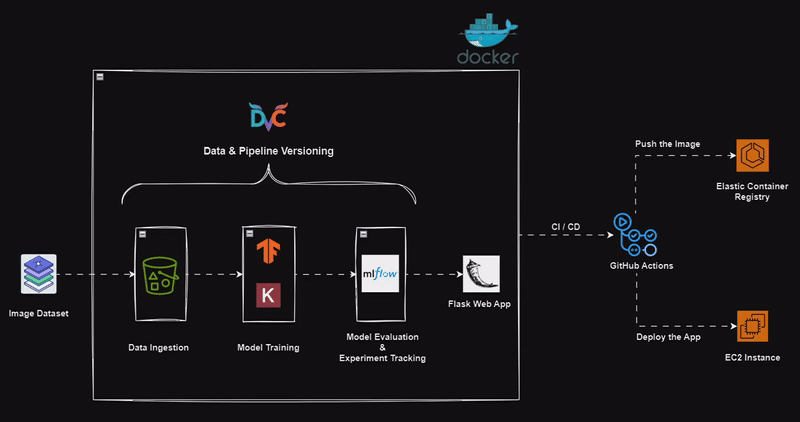

*Cancer Detection MLOps Project*
==================================

This repository contains the source code and necessary resources for a Cancer Detection MLOps project. The goal of this project is to develop and deploy a machine learning model for the early detection of cancer using medical imaging data. The project follows best practices in MLOps (Machine Learning Operations) to ensure a seamless and reproducible workflow from development to deployment.

**1. Installation**
^^^^^^^^^^^^^^^^^^^^^
Clone the repository using ``git``::

  git clone https://github.com/shail2512-lm10/cancer-detection-MLOps.git

Create the virtual environment (Recommended using conda)::

  cd cancer-detection-MLOps
  conda create -n myenv python=3.8 -y
  conda activate myenv

Install the packages and dependencies::

  pip install -r requirements.txt

Iniatalize DVC for reproducibility and model version control::

  dvc init

**2. Training & Evaluation**
^^^^^^^^^^^^^^^^^^^^^^^^^^^^^^^

Modify "params.yaml" file to experiment with different parameters.
You can also modify data_ingestion, and base_model file to change data source aswell as base model.

Then run the following DVC command for experiment tarcking using MLflow and reproducibility::

  dvc repro

This will run the pipeline from start to end as defined in dvc.yaml file. And it will also keep the track of any changes.

One can visualize the experiment history and analyze the different models and parameters on `Dagshub <https://dagshub.com/shail2512-lm10/cancer-detection-MLOps>`_

before running above command, set Mlflow env variables found on Dagshub page::

  export MLFLOW_TRACKING_URI=
  export MLFLOW_TRACKING_USERNAME=
  export MLFLOW_TRACKING_PASSWORD=

**3. Running the app locally**
^^^^^^^^^^^^^^^^^^^^^^^^^^^^^^^^^

Run the following command::

  python app.py

**4. Running the app on AWS server**
^^^^^^^^^^^^^^^^^^^^^^^^^^^^^^^^^^^^^^^
1. create ECR repo to store/save docker image
2. create EC2 machine (Ubuntu)
3. open EC2 and install Docker:
4. configure EC2 as self-hosted runner for github actions
5. setup  github secrets in your repo for AWS_SECRET_KEY and other as used in github actions "main.yaml" file.

**Tools used in this repository**
^^^^^^^^^^^^^^^^^^^^^^^^^^^^^^^^^^^^
1. Data versioning and pipeline: DVC
2. Model versioning and training monitoring: MLflow and Dagshub
3. Model Taining framework: Tensorflow 2.0, Keras
4. WebApp: Flask
5. Container: Docker
6. Deployment: AWS EC2 (Ubuntu)
7. CI/CDD: github actions
